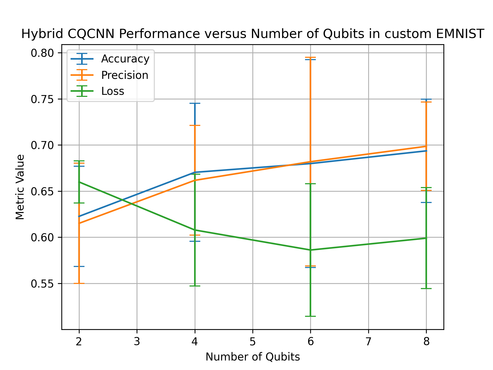
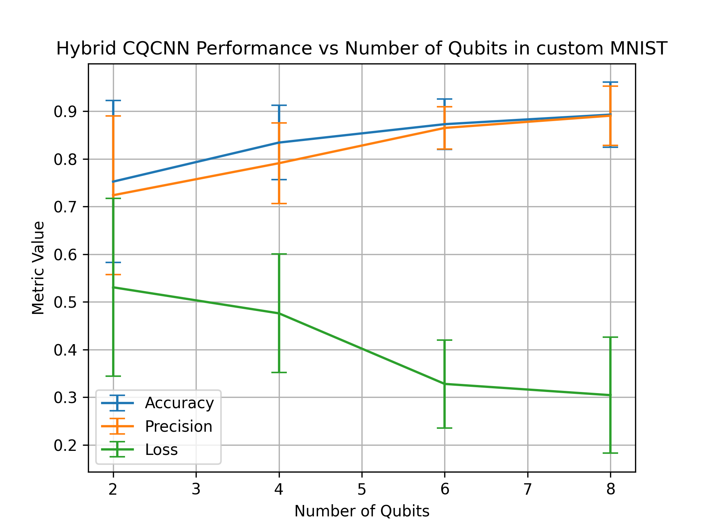

# Hybrid Quantum-Classical CNN — Evaluating the Impact of Qubit Count on Image Classification

This repository contains example code for hybrid quantum-classical convolutional neural networks (HQCNN). The goal is to compare model performance (accuracy, precision, F1, loss), runtime, and memory usage when varying the number of qubits in a parameterized quantum layer implemented using PennyLane's `default.qubit` simulator.

## Contents

- Introduction
- Requirements
- Installation
- Quick start (PowerShell)
- Problem descriptions (MNIST & EMNIST)
- Key configuration parameters
- Output files
- Dataset notes
- Troubleshooting
- License & contact

## Introduction

This repository includes two main training scripts that implement and evaluate a small HQCNN for binary image classification:

- `Mnist_training.py`: experiments on the MNIST dataset (the script filters for two target classes by default: 0 and 1).
- `Emnist_training.py`: experiments on the EMNIST `letters` split (the script filters classes 1 and 2 and remaps them to labels 0/1).

Each script performs standard preprocessing (grayscale, resize), selects a two-class subset, builds a lightweight CNN that projects features to a vector sized by the number of qubits, passes that vector through a PennyLane QNode (quantum layer), trains the hybrid model, evaluates on a test set, and saves summary outputs (Excel + PNG charts).

## Requirements

- Python 3.8+ (recommended 3.8–3.12)
- See `requirements.txt` for the full list of Python dependencies (torch, torchvision, pennylane, pandas, scikit-learn, matplotlib, psutil, etc.)
- The PennyLane `default.qubit` simulator is used — no quantum hardware is required.
- If available, PyTorch will use CUDA/GPU for the classical parts; the PennyLane QNode in these scripts runs on CPU by default.

## Installation

Open PowerShell in the repository root and run:

```powershell
# (optional) create and activate a virtual environment
python -m venv .venv; .\\.venv\\Scripts\\Activate.ps1

# upgrade pip
python -m pip install --upgrade pip

# install dependencies
pip install -r requirements.txt
```

Note: If you encounter issues installing `torch` for your platform or CUDA version, follow the instructions on the official PyTorch website to select the correct installation command.

## Quick start (PowerShell)

Run either training script from the repository root:

```powershell
python .\\Mnist_training.py

python .\\Emnist_training.py
```

Configuration parameters (e.g. `img_size`, `batch_size`, `epochs`, `qubit_list`) are defined at the top of each script and can be edited directly for quick experiments.

## Problem descriptions

1) `Mnist_training.py`
- Data: downloads MNIST via `torchvision.datasets.MNIST` (local folder `Mnist/`). The script filters for the two target classes defined by `TARGET_CLASSES = [0, 1]`.
- Model: a small CNN (1 channel → 12 filters → ReLU → MaxPool → flatten → Linear → Tanh) projects to a vector of length equal to the number of qubits. That vector is used as input to a PennyLane QNode (quantum layer). A final sigmoid classifier outputs a single probability for binary classification.
- Experiments: the default `qubit_list = [2, 4, 6, 8]` runs each configuration multiple times (`num_runs`) and stores mean/std metrics in `ResultMNIST.xlsx` and a PNG chart `ResultMNIST.png`.

2) `Emnist_training.py`
- Data: downloads EMNIST with `split='letters'` (local folder `Emnist/`), filters classes `TARGET_CLASSES = [1, 2]`, and remaps them to labels 0/1.
- Model & pipeline: identical architecture and evaluation pipeline to the MNIST script.
- Outputs: `ResultEMNIST.xlsx` and `ResultEMNIST.png`.

## Key configuration parameters

- `img_size`: input image resize (default 12)
- `batch_size`: batch size for training/evaluation (default 16)
- `epochs`: training epochs (default 5)
- `num_runs`: number of repeated runs per qubit configuration (default 5)
- `qubit_list`: list of qubit counts to evaluate (e.g. [2, 4, 6, 8])
- `device`: automatically selects CUDA if available for PyTorch; otherwise CPU

Edit these variables at the top of each script to run different experiments.

## Output files

- `ResultMNIST.xlsx` / `ResultEMNIST.xlsx`: summary tables containing mean and standard deviation for each metric across runs and qubit settings.
- `ResultMNIST.png` / `ResultEMNIST.png`: charts plotting metrics (accuracy, precision, loss) with error bars.
- The scripts also print confusion matrices and classification reports to the console (EMNIST script prints a detailed classification report).

Below are the result charts generated by the experiments (embedded for convenience):





## Dataset notes

- The repository contains folders `Mnist/` and `Emnist/` with raw IDX files. The training scripts will download data automatically if files are missing.
- Currently the code filters to two target classes and maps labels to 0/1. To run multiclass experiments you will need to modify the filtering logic and adjust the classifier (e.g. use `nn.Linear(..., num_classes)` + `CrossEntropyLoss`).

## Troubleshooting

- PyTorch installation errors: check Python version and OS, and obtain the correct install command from https://pytorch.org/get-started/locally/.
- PennyLane errors: ensure `pennylane` is installed and the `default.qubit` backend is available. For GPU acceleration or hardware backends, follow PennyLane's device/plugin documentation.
- High memory usage: reduce `batch_size` or `img_size`.
- Slow training: reduce `epochs` or test with fewer qubits first.

## Contact

If you would like help extending the experiments (multiclass support, hyperparameter tuning, running on quantum hardware), please open an issue or contact the repository owner.

## Citation

This paper was accepted to "The Seventh International Conference on Artificial Intelligence and Computational Intelligence 2026 (AICI 2026)" in Hanoi, Vietnam.
When the paper is published, I will soon post the link here


